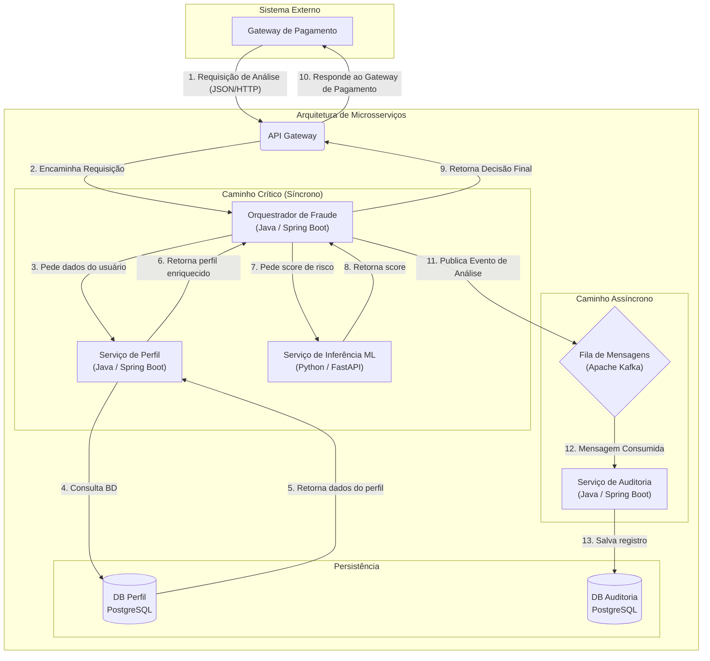

# Sistema de Detecção de Fraudes com Microsserviços e Machine Learning

Este repositório contém o código-fonte de um sistema de detecção de fraudes em tempo real, desenvolvido como um Trabalho de Conclusão de Curso (TCC).  
O projeto implementa uma arquitetura de microsserviços onde a análise de risco e a decisão são distribuídas entre diferentes componentes, com um serviço dedicado para a inferência de Machine Learning.

## Visão Geral

O objetivo principal é simular um cenário onde uma transação financeira precisa ser avaliada quanto ao risco de fraude antes de ser aprovada, com a menor latência possível.  
O sistema recebe os dados da transação, enriquece-os com informações do perfil do usuário, utiliza um modelo de Machine Learning para calcular um score de risco e, finalmente, aplica uma lógica de decisão sensível ao custo (baseada no Bayes Minimum Risk) para recomendar uma ação (aprovar, revisar ou negar).

## Tecnologias Utilizadas

* **Linguagens:** Java 21, Python 3.12
* **Frameworks/Bibliotecas:**
    * **Java:** Spring Boot 3.2.5, Spring Cloud Gateway, Spring WebFlux, Spring Data JPA, Hibernate, Jackson, Maven.
    * **Python:** FastAPI, Uvicorn, Pydantic, XGBoost, NumPy.
* **Banco de Dados:** PostgreSQL 15.
* **Conteinerização e Orquestração:** Docker, Docker Compose.

## Arquitetura Proposta

O sistema segue o padrão de arquitetura em contêineres Docker para os microsserviços, com comunicação síncrona para o fluxo crítico de análise e assíncrona para um futuro serviço de auditoria ainda não implementado.



## Estrutura de Diretórios

O projeto está organizado em um monorepo, onde cada microsserviço reside em seu próprio diretório, facilitando a execução e o gerenciamento com Docker Compose.

```
.
├── api-gateway     # Módulo do API Gateway (Java/Spring Cloud Gateway)
│   ├── .mvn
│   ├── src
│   │   └── main
│   │       ├── java
│   │       │   └── com
│   │       │       └── apigateway
│   │       │           └── gateway
│   │       │               ├── config
│   │       │               │   └── GatewayConfig.java
│   │       │               └── ApiGatewayApplication.java
│   │       └── resources
│   │           └── application.properties
│   ├── Dockerfile
│   ├── mvnw
│   ├── mvnw.cmd
│   └── pom.xml
│
├── audit-service
│  ├── .mvn
│  ├── src
│  │   └── main
│  │       ├── java
│  │       │   └── com
│  │       │       └── frauddetector
│  │       │           └── auditservice
│  │       │               ├── dto
│  │       │               │   ├── AnalysisResponseDTO.java
│  │       │               │   └── AuditLogEvent.java
│  │       │               ├── entity
│  │       │               │   └── AuditLog.java
│  │       │               ├── repository
│  │       │               │   └── AuditLogRepository.java
│  │       │               ├── service
│  │       │               │   └── AuditConsumer.java
│  │       │               └── AuditApplication.java
│  │       └── resources
│  │           └── application.properties
│  ├── Dockerfile
│  ├── mvnw
│  ├── mvnw.cmd
│  └── pom.xml
│
├── inference-service       # Módulo do Serviço de Inferência (Python/FastAPI)
│   ├── app
│   │   └── main.py         # Contém os endpoints e a lógica de predição
│   ├── Dockerfile
│   └── requirements.txt    # Dependências Python
│
├── orchestrator        # Módulo do Serviço Orquestrador (Java/Spring Boot)
│   ├── .mvn
│   ├── src
│   │   └── main
│   │       ├── java
│   │       │   └── com
│   │       │       └── frauddetector
│   │       │           └── orchestrator
│   │       │               ├── controller
│   │       │               │   └── FraudController.java
│   │       │               ├── dto
│   │       │               │   ├── AnalysisRequestDTO.java
│   │       │               │   ├── AnalysisResponseDTO.java
│   │       │               │   ├── TransactionDTO.java
│   │       │               │   └── UserProfileDTO.java
│   │       │               └── OrchestratorApplication.java
│   │       └── resources
│   │           └── application.properties
│   ├── Dockerfile
│   ├── mvnw
│   ├── mvnw.cmd
│   └── pom.xml
│
├── profile-service     # Módulo do Serviço de Perfil (Java/Spring Boot + JPA)
│   ├── .mvn
│   ├── src
│   │   └── main
│   │       ├── java
│   │       │   └── com
│   │       │       └── frauddetector
│   │       │           └── profile
│   │       │               ├── controller
│   │       │               │   └── ProfileController.java
│   │       │               ├── entity
│   │       │               │   └── UserProfile.java
│   │       │               ├── repository
│   │       │               │   └── UserProfileRepository.java
│   │       │               └── ProfileApplication.java
│   │       └── resources
│   │           └── application.properties
│   ├── Dockerfile
│   ├── mvnw
│   ├── mvnw.cmd
│   └── pom.xml
│
├── docker-compose.yml      # Arquivo de orquestração do Docker Compose
├── .env                    # Não versionado, use .env.example como referência
├── .env.example            # Exemplo de variáveis de ambiente
├── .gitignore
├── LICENSE
└── README.md
```

## Detalhamento dos Módulos (Microsserviços)

### 1. `api-gateway`

* **Tecnologias:** Java 21, Spring Boot, Spring Cloud Gateway.
* **Responsabilidade:** É o ponto de entrada único para todas as requisições externas. Suas funções incluem:
    * **Roteamento:** Encaminha as requisições recebidas na porta `8080` para os serviços internos apropriados (neste caso, para o `orchestrator` na rota `/analyze`).
    * **Desacoplamento:** Abstrai a topologia interna dos microsserviços do cliente externo.

### 2. `orchestrator`

* **Tecnologias:** Java 21, Spring Boot, Spring WebFlux, Spring Kafka.
* **Responsabilidade:** É o cérebro do fluxo de análise.
    1.  Recebe a requisição do `api-gateway`.
    2.  Chama o `profile-service` (síncrono) para enriquecer os dados.
    3.  Chama o `inference-service` (síncrono) com os dados enriquecidos.
    4.  Retorna a decisão final (síncrona) para o `api-gateway`.
    5.  Publica um evento de auditoria (assíncrono) no tópico do Kafka.

### 3. `profile-service`

* **Tecnologias:** `Java 21`, `Spring Boot`, `Spring Data JPA`, `PostgreSQL`.
* **Responsabilidade:** Gerencia e fornece os dados de perfil dos usuários. Atua como a fonte de dados para o enriquecimento realizado pelo orquestrador.
    * **Persistência:** Utiliza o Spring Data JPA para interagir com o banco de dados PostgreSQL (`db-profile`).
    * **API:** Expõe um endpoint REST (`GET /profiles/{userId}`) para consulta dos dados. Atualmente, possui um usuário de teste (`user123`) inserido na inicialização.

### 4. `inference-service`

* **Tecnologias:** `Python 3.12`, `FastAPI`, `Pydantic`, `XGBoost` (simulado).
* **Responsabilidade:** É o cérebro de decisão do sistema. Recebe os dados enriquecidos e aplica a lógica de Machine Learning.
    * **API:** Expõe um endpoint REST (`POST /predict`) que recebe os dados da análise.
    * **Modelo ML (Simulado):** Atualmente, simula a predição de um modelo XGBoost por regras, retornando uma probabilidade de fraude (0.0 a 1.0).
    * **Lógica de Decisão:** Implementa a teoria do `Bayes Minimum Risk` (baseada no artigo *[Cost Sensitive Credit Card Fraud Detection Using Bayes Minimum Risk](https://albahnsen.github.io/files/Cost%20Sensitive%20Credit%20Card%20Fraud%20Detection%20using%20Bayes%20Minimum%20Risk%20-%20Publish.pdf)*) para calcular um limite de decisão dinâmico, que leva em conta o valor da transação.  
      Com base na comparação entre a probabilidade e o limite, recomenda uma ação (`APPROVE`, `REVIEW`, `DECLINE`).

### 5. `audit-service`

* **Tecnologias:** Java 21, Spring Boot, Spring Kafka, Spring Data JPA.
* **Responsabilidade:** Operar de forma assíncrona.
    * Escuta o tópico `fraud_analysis_events` do Kafka.
    * Consome as mensagens de auditoria (enviadas pelo `orchestrator`).
    * Salva cada análise de fraude em seu próprio banco de dados (`db-audit`) para persistência de longo prazo, rastreabilidade e conformidade.

### 6. `db-profile` e `db-audit` (Bancos de Dados)
* **Tecnologias:** PostgreSQL 15 (Imagens Docker).
* **Responsabilidade:** Armazenam os dados dos serviços `profile` e `audit`, respectivamente. São executados em contêineres separados e persistem seus dados em volumes Docker.

### 7. `kafka` (Mensageria)
* **Tecnologias:** Bitnami Legacy Kafka (imagem Docker).
* **Responsabilidade:** Atua como o *message broker* (fila de mensagens) que desacopla o fluxo síncrono do assíncrono. Garante que os eventos de auditoria sejam entregues de forma durável e resiliente, mesmo que o `audit-service` esteja temporariamente offline.

## Detalhamento do `docker-compose.yml`

O arquivo `docker-compose.yml` na raiz do projeto orquestra a inicialização e a rede de todos os serviços.

* **`services`**: Define cada contêiner que compõe a aplicação:
    * **`api-gateway`, `audit-service`, `orchestrator`, `profile-service`, `inference-service`**:
        * `build: ./<nome-do-servico>`: Instrui o Docker Compose a construir a imagem Docker a partir do `Dockerfile` localizado no diretório especificado.
        * `container_name: <nome-do-servico>`: Define um nome fixo para o contêiner.
        * `ports: - "<porta_host>:<porta_container>"`: Mapeia uma porta do seu computador (host) para uma porta dentro do contêiner, permitindo acesso externo.
        * `depends_on`: Define dependências entre os serviços, garantindo que certos contêineres sejam iniciados antes de outros.
        * `environment`: Injeta variáveis de ambiente no contêiner. É usado aqui para passar as credenciais do banco de dados de forma segura, lidas do arquivo `.env`. O Spring Boot automaticamente lê variáveis como `SPRING_DATASOURCE_USERNAME` e as usa para configurar a aplicação.
        * `healthcheck`: Define um comando (`curl` chamando um endpoint `/health` ou `/actuator/health`) que o Docker executa periodicamente para verificar se a aplicação dentro do contêiner está realmente funcionando. A condição `service_healthy` no `depends_on` usa o resultado deste `healthcheck`.
    * **`db-profile` / `db-audit`**:
        * `image: postgres:15-alpine`: Usa uma imagem oficial do PostgreSQL do Docker Hub.
        * `environment`: Define variáveis de ambiente essenciais para o PostgreSQL (usuário, senha, nome do banco), lendo os valores do arquivo `.env`.
        * `volumes: - <nome-volume>:/var/lib/postgresql/data`: Mapeia o diretório interno onde o PostgreSQL guarda seus dados para um volume nomeado, garantindo a persistência dos dados.
        * `healthcheck`: Usa o comando `pg_isready` para verificar se o banco de dados está pronto para aceitar conexões.
* **`volumes`**: Declara os volumes nomeados usados pelos serviços.

---

## Configuração do Ambiente e Segredos

Para executar o projeto, é necessário configurar as variáveis de ambiente para as credenciais dos bancos de dados.  
Para evitar expor senhas e outras informações sensíveis no controle de versão, utilizamos um arquivo `.env` que não é versionado:

* **`.env` (Não versionado):** Arquivo na raiz do projeto onde você deve colocar as variáveis de ambiente reais. O Docker Compose lê este arquivo automaticamente. Crie-o a partir do exemplo abaixo.
* **[`.env.example`](./.env.example) (Versionado):** Um arquivo de exemplo mostrando quais variáveis são esperadas no `.env`.
    ```env
    # Credenciais do banco de dados do serviço de perfil
    DB_PROFILE_USER=
    DB_PROFILE_PASSWORD=
    DB_PROFILE_NAME=
    
    # Credenciais do banco de dados do serviço de auditoria
    DB_AUDIT_USER=
    DB_AUDIT_PASSWORD=
    DB_AUDIT_NAME=
    ```

## Como Executar

1.  **Clone o repositório:**
    ```bash
    git clone https://github.com/Afonso017/fraud-detector
    ```

2.  **Navegue até a pasta raiz do projeto:**
    ```bash
    cd fraud-detector
    ```

3.  **Configure o ambiente:**
Renomeie o arquivo `.env.example` para `.env`, depois edite-o para adicionar as credenciais dos bancos de dados.
    ```bash
    mv .env.example .env
    ```

4. **Suba toda a arquitetura com Docker Compose:**
Este comando irá construir as imagens Docker e iniciar todos os contêineres.
     ```bash
     docker compose up --build
     # Use 'docker compose up --build -d' para rodar em segundo plano
     ```

5. **Verifique se os contêineres iniciaram corretamente:**
Aguarde um pouco (especialmente para os serviços Java) e verifique o status.
    ```bash
    docker compose ps
    ```
    Todos os serviços devem estar com status `running` ou `healthy`.

## Como Testar

Após todos os contêineres estarem rodando e saudáveis, envie uma requisição de análise de fraude para o `api-gateway` na URL `http://localhost:8080/analyze`.

* Corpo JSON da requisição (pode testar com diferentes valores de transação):
    ```json
    {
        "userId": "user123",
        "value": 500.0
    }
    ```

* Você pode enviar a requisição usando `curl` (ou alguma ferramenta como Postman ou Insomnia):
    ```bash
    curl -X POST -H "Content-Type: application/json" \
         -d '{"userId": "user123", "value": 500.0}' \
         http://localhost:8080/analyze
    ```

* **Exemplo de resposta esperada (para `value: 500.0`):**
    ```json
    {
        "status": "ANALYSIS_COMPLETE",
        "riskAnalysis": {
            "riskScore": 0.4126728747874845,
            "recommendedAction": "REVIEW"
        }
    }
    ```
  A resposta mostra que a transação foi analisada, com um score de risco e uma ação recomendada. Você pode testar com valores menores (ex: `10.0`) para ver a ação mudar para `APPROVE`.

* **Para parar a aplicação:**
    * `CTRL + C` no terminal onde o Docker Compose está rodando, se não estiver em modo detached (-d).
    * Ou execute:
        ```bash
        docker compose down
        # Use 'docker compose down -v' para remover também o volume do banco de dados
        ```